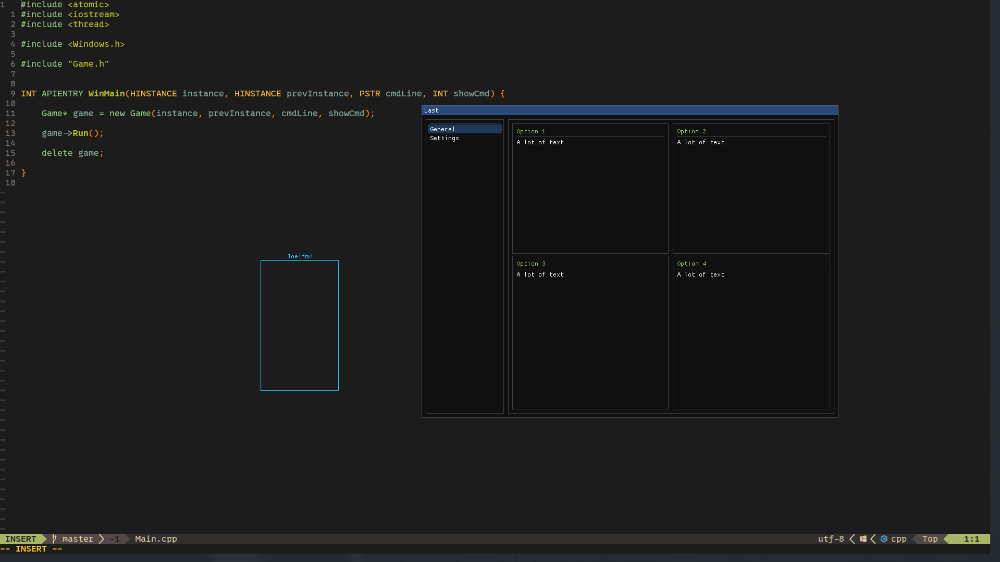

## Overlay

Simple external overlay built with `DirectX 11` for rendering and `ImGui` for drawing, designed (or at least idealized) to be modular for easy extension and customization

### Features
- **Lightweight** - With minimal overhead for fast, efficient rendering
- **Thread-safe updates** – For multithreaded use, allowing smooth concurrent updates
- **Flexible object rendering** – Supports `circles`, `lines`, `rectangles`, `filled rectangles`, and `text`, with easy extensibility through `ImDrawList`

### ShowCase

> [!IMPORTANT]  
> The application must be run in **Fullscreen Windowed** mode for the overlay to function correctly

